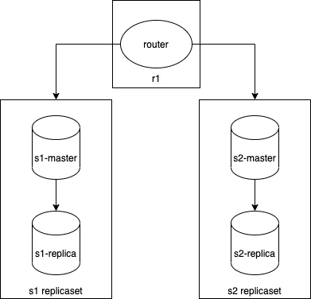

# Tarantool Spring PetClinic Sample Application

## Understanding the original Spring Petclinic application with a few diagrams
<a href="https://speakerdeck.com/michaelisvy/spring-petclinic-sample-application">See the presentation here</a>

## Running petclinic locally
First you need to [install](https://www.tarantool.io/en/download/os-installation/) tarantool on the system. Well, then you need to start the tarantool cluster:
```
git clone git@github.com:ArtDu/spring-petclinic-tarantool.git
cd spring-petclinic-tarantool/cluster
cartridge build                                                                         # Install modules
cartridge start -d                                                                      # Start cluster in deamonize mode
cartridge replicasets setup --bootstrap-vshard                                          # Setup replica sets described in a file replicasets.yml
curl -X POST http://localhost:8081/migrations/up                                        # Run cluster-wide migrations for your data
echo "require('data')" | tarantoolctl connect admin:secret-cluster-cookie@0.0.0.0:3301  # Fill the cluster with initial data by passing in router
```
Petclinic is a [Spring Boot](https://spring.io/guides/gs/spring-boot) application built using [Maven](https://spring.io/guides/gs/maven/). You can build a jar file and run it from the command line:


```
cd ..
./mvnw package
java -jar target/*.jar
```

You can then access petclinic here: http://localhost:8080/


Or you can run it from Maven directly using the Spring Boot Maven plugin. If you do this it will pick up changes that you make in the project immediately (changes to Java source files require a compile as well - most people use an IDE for this):

```
./mvnw spring-boot:run
```

**Version restrictions**  
For this example, version restrictions were found:
The `cartridge replicasets setup` command works only when `cartridge-cli >= 2.5.0`.   
In the future, the example will be improved to work without limiting versions.

## About tarantool cluster


Tarantool is Reliable NoSQL DBMS.
This example is run using the [cartridge framework](https://www.tarantool.io/en/cartridge/),
which is a powerful orchestrator for Tarantool.
Data sharding is performed on the principle of virtual buckets using the [vshard module](https://github.com/tarantool/vshard).
Therefore, to begin with, we must install all the necessary modules, they are described in the `testserver-scm-1.rockspec`
file using the command `tarantoolctl rocks make`

---
All the code with the cluster logic is in the cluster folder. Using the `cartridge start -d` command, the cartridge framework starts several tarantool instances, the configuration of which is described in the instances.yml file:
```yaml
---
testserver.router:
  advertise_uri: localhost:3301
  http_port: 8081

testserver.s1-master:
  advertise_uri: localhost:3302
  http_port: 8082

testserver.s1-replica:
  advertise_uri: localhost:3303
  http_port: 8083

testserver.s2-master:
  advertise_uri: localhost:3304
  http_port: 8084

testserver.s2-replica:
  advertise_uri: localhost:3305
  http_port: 8085

testserver-stateboard:
  listen: localhost:3310
  password: passwd
```

It follows that we are launching 6 tarantool instances.

---
Next, we create a topology from these instances using the command:
`cartridge replicasets setup --bootstrap-vshard`  
The cluster configuration is located in the replicasets.yml file:
```yaml
r1:
  instances:
    - router
  roles:
    - vshard-router
    - crud-router
    - app.roles.api_router
  all_rw: false
s1:
  instances:
    - s1-master
    - s1-replica
  roles:
    - vshard-storage
    - crud-storage
    - app.roles.api_storage
  weight: 1
  all_rw: false
  vshard_group: default
s2:
  instances:
    - s2-master
    - s2-replica
  roles:
    - vshard-storage
    - crud-storage
    - app.roles.api_storage
  weight: 1
  all_rw: false
  vshard_group: default

```




---

Next, using the [migration module ](https://github.com/tarantool/migrations) can run cluster-wide migrations for your data
`curl -X POST http://localhost:8081/migrations/up`

and fill in the data using a tarantool router connection:
`echo "require('data')" | tarantoolctl connect admin:secret-cluster-cookie@0.0.0.0:3301`
``

## Database configuration

This default configuration assumes the use of [tarantool noSQL database](https://www.tarantool.io/). Tarantool and spring work using a special module for [cartridge-springdata](https://github.com/tarantool/cartridge-springdata). Therefore, the database configuration is somewhat different from the default h2.

### Data Model diagram
Let's look at the data model:
  
Here we can immediately see that there are no familiar relationships using foreign keys, and the datatype of the primary keys is uuid.
To keep data normalization, data splitting and joining are being did in a special way:

1. We use **uuid** as it is much faster than using any auto-increment on the storage cluster.
   UUID can be generated both on the client and on the side of tarantool application scripts.
2. **Join** happens predominantly on storages, if possible, and is aggregated using map reduce.
3. Fields where the data type is indicated with a question mark means that this field can be **nullable**, this is done so that we can return data nested using custom joins.
4. Since there are no foreign keys, **secondary indexes** were added to quickly fetch data. In the diagram, they are indicated by a graph tree.


### Data nesting and joining
You can nest data from one space into another. To do this, you need to place an empty field in space_object: format. When transferring data from the database to the client, add data to this stub.
E.g.:
```lua
owners:format({
    { name = "id", type = "uuid" },
    { name = "first_name", type = "string" },
    { name = "last_name", type = "string" },
    { name = "address", type = "string" },
    { name = "city", type = "string" },
    { name = "telephone", type = "string" },
    { name = "bucket_id", type = "unsigned" },
    { name = "pets", type = "map", is_nullable = true }
})
```
We will return the owner's data along with his pets. For embedding data, we have a pets field. NULL is stored in these field on storages.
```lua
-- OneToMany = Owners -> Pets
local function find_owner_by_id_without_pet_type(id)
    local owner = crud.select("owners", {{'=', 'id', id}})
    local pets = crud.select("pets", {{'=', 'owner_id', owner.rows[1][1]}})
    pets = crud.unflatten_rows(pets.rows, pets.metadata)
    owner.rows[1][8] = pets
    return owner
end
```

As we can see, the data join occurs using the [crud](https://github.com/tarantool/crud) module, which allows us to make quieries to the cluster. If we do not have enough crud functionality, then we can use cartridge.pool.map_call. Just to demonstrate this, let's see how the **many to many** case is implemented:

The join of two tables vets and vet_specialties occurs on the storages, the result is returned to the router, and on the router, data from the 3rd table is pulled up afterwards:

storage:
```lua
local function get_vets_with_specialties_id()
    local vets = {}
    for _, vet in box.space.vets:pairs() do
        local specialties_ids = {}
        local specialties = box.space.vet_specialties.index.vet_id:select(vet[1])
        for _, specialty in pairs(specialties) do
            local specialty_id = specialty[2]
            table.insert(specialties_ids, specialty_id)
        end
        vet = vet:totable()
        table.insert(vet, specialties_ids)
        table.insert(vets, vet)
    end
    return vets
end
```

router:
```lua
local function get_vets_with_specialties()
    local vets_list = {}
    local vets_by_storage, err =
    cartridge_pool.map_call('get_vets_with_specialties_id', {}, { uri_list = get_uriList() })
    if err then
        return nil, err
    end
    for _, vets in pairs(vets_by_storage) do
        for _, vet in pairs(vets) do
            local specialties = {}
            -- one vet may has many specialties
            for _, specialty_id in pairs(vet[#vet]) do
                local specialty = crud.get("specialties", specialty_id)
                table.insert(specialties, crud.unflatten_rows(specialty.rows, specialty.metadata)[1])
            end
            -- replace specialty id by specialty name
            vet[5] = specialties
            table.insert(vets_list, vet)
        end
    end
    return vets_list
end
```


## Work from java client

Interaction with Tarantool can be done by using Tarantool function binding via Query annotation indicated above or by using a standard CrudRepository functions (like findById, save, etc...).

```java
// Binding tarantool function
@Query(function = "find_owner_by_id")
Owner findOwnerById(UUID id);

// Using default CrudRepository operations
Owner save(Owner owner);
```

Data mapping from tarantool spaces to java entities is implemented with @tuple and @field annotations. See [tarantool-springdata]((https://github.com/tarantool/cartridge-springdata)) module for details.

```java
@Tuple("visits")
public class Visit extends BaseEntity {

    @Field(name = "visit_date")
    @DateTimeFormat(pattern = "yyyy-MM-dd")
    private LocalDate date;

    @NotEmpty
    @Field(name = "description")
    private String description;
...
}
```

Data is obtained from cluster via custom functions lua functions or '[crud](https://github.com/tarantool/crud)' library that execute on 'router' instance. Here is an example of configuration to establish connection to tarantool router instance:
```java
@Configuration
@EnableTarantoolRepositories(basePackageClasses = { VetRepository.class, OwnerRepository.class, PetRepository.class,
        PetTypeRepository.class, VisitRepository.class })
public class TarantoolConfiguration extends AbstractTarantoolDataConfiguration {

    // localhost
    @Value("${tarantool.host}")
    protected String host;

    // 3301 is our router
    @Value("${tarantool.port}")
    protected int port;

    // admin
    @Value("${tarantool.username}")
    protected String username;

    // secret-cluster-cookie
    @Value("${tarantool.password}")
    protected String password;

    @Override
    protected void configureClientConfig(TarantoolClientConfig.Builder builder) {
        builder.withConnectTimeout(1000 * 5).withReadTimeout(1000 * 5).withRequestTimeout(1000 * 5);
    }

    @Override
    public TarantoolCredentials tarantoolCredentials() {
        return new SimpleTarantoolCredentials(username, password);
    }

    @Override
    protected TarantoolServerAddress tarantoolServerAddress() {
        return new TarantoolServerAddress(host, port);
    }

    @Override
    public TarantoolClient<TarantoolTuple, TarantoolResult<TarantoolTuple>> tarantoolClient(
            TarantoolClientConfig tarantoolClientConfig,
            TarantoolClusterAddressProvider tarantoolClusterAddressProvider) {
        return new ProxyTarantoolTupleClient(
                super.tarantoolClient(tarantoolClientConfig, tarantoolClusterAddressProvider));
    }

}

```


# License

The Spring PetClinic sample application is released under version 2.0 of the [Apache License](https://www.apache.org/licenses/LICENSE-2.0).

